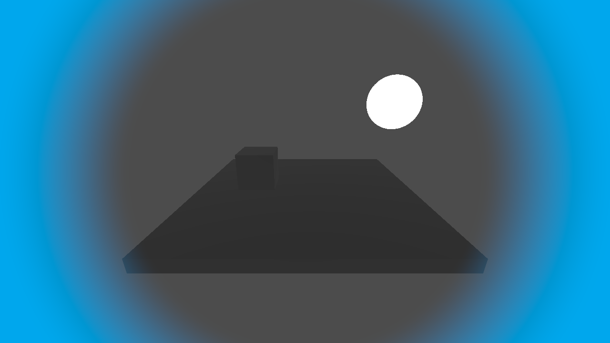
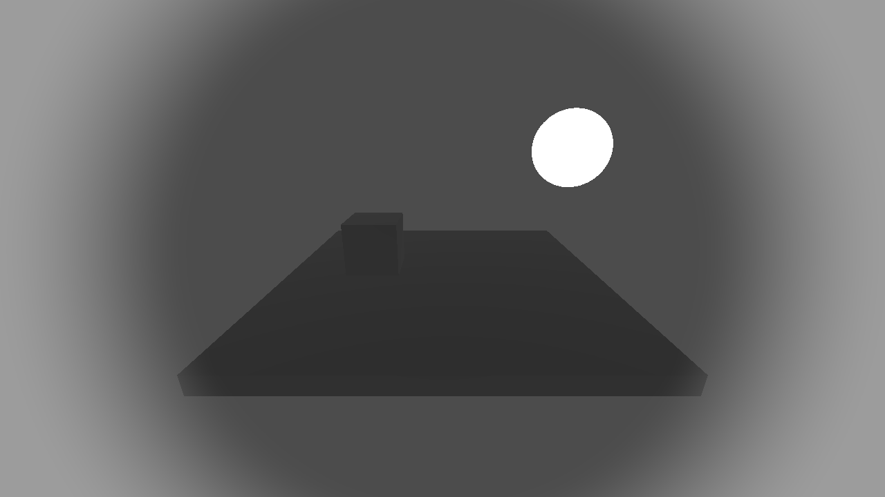
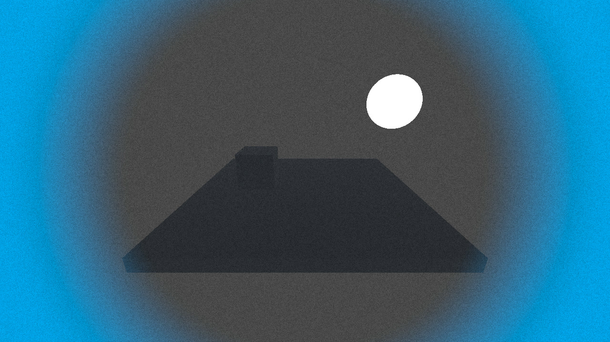
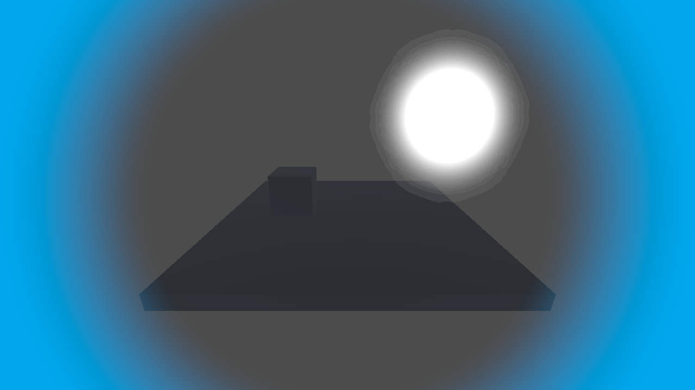

# Post Effect Stack

Formerly "Post Effect Resource".

For Godot 4.7. Stack multiple post-processing effects by arranging them in a `.tres` array — applied in order, with no manual intermediate buffer management. Uses `CompositorEffect` on Forward+, and a `CanvasLayer` path on Mobile/Compatibility, from the same effect definitions.

This addon is not an "effect collection". The bundled 10 effects are working samples — the real product is the mechanism for stacking multiple effects safely and in order (`EffectStackResource` / `EffectStackRunner`).

- Supported versions: verified on Godot 4.7 / 4.7.1 (4.8-dev tracked)
- License: MIT
- `CompositorEffect` is documented as Experimental, but its public API hasn't had a single breaking change since its introduction in 2023-08 (as of 2026-08)

---

## What it can't do

- Automatic switching between Forward+ / Mobile paths is **not implemented**. The user must choose the path manually
- `Outline` requires a depth buffer, so there's no canvas (Mobile/Compatibility) fallback
- `Bloom`'s canvas version is a single-pass approximation and won't exactly match the compute version
- The `Compatibility` renderer doesn't support `CompositorEffect` itself (canvas path only)

---

## Folder structure

| Folder | Required | Contents |
|---|---|---|
| `addons/post_effect_stack/` | Required | The engine itself (Resource base class, Runner, shader template). Contains zero effects |
| `effects/` | Required (if using the bundled 10 effects) | Working sample effect implementations. Not needed if you only use your own effects |
| `demo/`, `scenes/` | Optional | Demo scenes for verifying behavior. Not needed to integrate into your project |
| `LICENSE` | Optional | Full MIT license text |

Note this isn't a "plugin-only" layout — it's a framework structure that separates `addons/` (the mechanism) from `effects/` (the content).

---

## Quick start

1. Copy both `addons/post_effect_stack/` (the engine) and `effects/` (the bundled effect collection) into your project, and enable the plugin
2. Create a new `EffectStackResource`, and in the Inspector add the effects you want (`.tres`, e.g. `effects/vignette/vignette.tres`) to the `effects` array
3. Add an `EffectStackRunner` (`CompositorEffect`) to `WorldEnvironment`'s `Compositor`, and assign the resource above to `stack_resource`
4. Previewed live in the editor's 3D viewport (`@tool` supported)

---

## Stacking two or more effects

`EffectStackResource.effects` is an array, and it's **executed in-place, in order from the first element**. Effects later in the array have a stronger influence on the final look.

```text
screen_color → effects[0] → effects[1] → effects[2] → screen_color
```

Drag elements in the Inspector to reorder them; the order is preserved on save. Add/remove is also done through the Inspector's array editing UI.

### Example: order changes the result

Stacking `Grayscale` (desaturates) and `Vignette` (blue-tinted edge darkening) in different orders visibly changes the final image.

| `[Grayscale, Vignette]` | `[Vignette, Grayscale]` |
|---|---|
|  |  |
| Vignette applies last, so a blue tint remains at the screen edges | Grayscale applies last, so Vignette's color information is lost too and the whole image turns gray |

Example 3-effect stack (`Vignette + Scanline + Grain`):



Multi-pass effects (`Bloom`) can also be mixed into the same stack:



### About `callback_type`

Godot's `CompositorEffect.EffectCallbackType` is a single enum value, not a bit flag. As a result:

- **One `EffectStackRunner` handles exactly one `effect_callback_type`** (chosen in the Inspector)
- Each effect only runs if its `effect_callback_type` matches the Runner's setting
- To run effects at multiple stages (e.g. both `POST_SKY` and `POST_TRANSPARENT`), **register multiple `EffectStackRunner`s on the Compositor**

### Enabling/disabling

Turning off an effect's `enabled` flag immediately excludes just that effect from the stack (no extra signal wiring needed).

---

## Effect authoring guide

A new effect is made up of the following 3 files (see `effects/vignette/` etc. for real examples).

1. `<name>.gd` — extends `PostEffect` and builds the parameters passed to the shader in `_build_push_constant()`
2. `<name>.glsl` — a compute shader written using the `#COMPUTE_CODE` substitution in `addons/post_effect_stack/shaders/template_post_effect.glsl`
3. `<name>.tres` — a preset Resource holding the default parameters

Set `needs_depth = true` if a depth buffer is required. For multi-pass effects (see `Bloom`), set `_is_multi_pass = true` and implement `_render_multi_pass()`. Single-pass effects don't need this.

When `needs_depth = true`, the depth buffer is automatically bound to `binding = 1`. If you add your own uniforms via `_get_additional_uniforms()` alongside `needs_depth = true`, use `binding = 2` and up (to avoid a collision).

To provide a canvas path for Mobile/Compatibility, add a `<name>_canvas.gdshader` (based on `hint_screen_texture`) and assign it to `effect_material` on `addons/post_effect_stack/canvas_post_effect.tscn`. Depth-dependent effects can't provide a canvas path.

---

## Porting an existing standalone shader to this format

To port a standalone post-processing shader (e.g. one distributed on godotshaders.com) into this format:

1. Move the shader's fragment/compute body into the `#COMPUTE_CODE` section of `<name>.glsl`
2. Map the shader's uniform parameters to `@export` properties on `<name>.gd`, and pass them as a push constant in `_build_push_constant()`
3. Set the default values in `<name>.tres`
4. Add it to `EffectStackResource.effects`, and it can now be combined with other effects in order

This removes the need for the manual `BackBufferCopy` + `Viewport` setup normally required to stack two or more standalone shaders.

---

## Renderer support matrix

| Feature | Forward+ | Mobile | Compatibility |
|---|---:|---:|---:|
| `CompositorEffect` API | Supported | Supported | Not supported |
| This addon's compute path | Supported | Not guaranteed ([godot#96737](https://github.com/godotengine/godot/issues/96737)) | Not supported |
| depth / normal-roughness access | Supported | Verified case-by-case | Not supported |
| canvas path (fallback) | Supported | Supported | Supported |
| Editor preview | Supported via `@tool` | Verified case-by-case | canvas path only |

The canvas path has been verified working on real Mobile hardware for 9 effects (Grayscale / Vignette / ChromaticAberration / Scanline / Grain / Pixelate / Dither / Bloom / ColorGrading — see the demo scenes under `scenes/mobile_test/`).

---

## Included effects

| Effect | Buffers needed | compute | canvas |
|---|---|:---:|:---:|
| Grayscale | Color | ○ | ○ |
| Vignette | Color | ○ | ○ |
| ColorGrading (LUT) | Color | ○ | △ (LUT is an inline GradientTexture2D) |
| ChromaticAberration | Color | ○ | ○ |
| Scanline | Color | ○ | ○ |
| Grain/Noise | Color | ○ | ○ |
| Pixelate | Color | ○ | ○ |
| Bloom | Color (multi-pass) | ○ | △ (single-pass approximation) |
| Dither | Color | ○ | ○ |
| Outline | Color + Depth | ○ | Not possible (depth buffer not supported) |

---

## API reference (overview)

### `PostEffect` (`addons/post_effect_stack/post_effect.gd`)

Defines a single effect. Extends `Resource`.

| Member | Purpose |
|---|---|
| `shader_file: RDShaderFile` | Reference to the compute shader |
| `effect_callback_type` | Execution stage, e.g. `POST_TRANSPARENT` |
| `needs_depth: bool` | Whether the depth buffer needs to be bound |
| `enabled: bool` | Enable/disable |
| `_build_push_constant(screen_size, view)` | Override in a subclass to build the values passed to the shader |
| `_get_additional_uniforms()` | Override when additional uniforms (e.g. textures) are needed |
| `_is_multi_pass` / `_render_multi_pass(...)` | For multi-pass effects (see `Bloom`) |

### `PostEffectRunner` (`addons/post_effect_stack/post_effect_runner.gd`)

A `CompositorEffect` that runs a single `PostEffect`. Lower overhead than `EffectStackRunner` for single-effect use.

### `EffectStackResource` (`addons/post_effect_stack/effect_stack_resource.gd`)

A Resource holding `effects: Array[PostEffect]`. Supports reordering, adding, and removing in the Inspector.

### `EffectStackRunner` (`addons/post_effect_stack/effect_stack_runner.gd`)

A `CompositorEffect` that takes an `EffectStackResource` and runs the effects, in array order, that are `enabled` and whose `effect_callback_type` matches. Shaders/pipelines are cached keyed by resource path.

---

## Migrating from an older version

`v0.2.0` renamed the addon from "Post Effect Resource" to "Post Effect Stack" and changed paths/class names. There is no compatibility shim — update your project as follows:

1. Delete the old `addons/post_effect_resource/` directory from your project.
2. Copy in the new `addons/post_effect_stack/` directory (and update `effects/` if you use the bundled effects).
3. If you wrote a custom effect that extended `PostEffectResource`, change it to extend `PostEffect` instead. The base class was renamed; its members and behavior are unchanged.
4. Re-enable the plugin in Project Settings > Plugins if it was disabled after the directory swap (Godot may deactivate a plugin whose folder disappeared).
5. Any `.tres` / `.tscn` files that reference `res://addons/post_effect_resource/...` paths need to be repointed to `res://addons/post_effect_stack/...` (Godot's path remap on file move usually handles this automatically if you move files within the same project; a manual copy-in does not).

No other classes were renamed: `PostEffectRunner`, `EffectStackResource`, and `EffectStackRunner` keep their names.

---

## License

MIT License. See the `LICENSE` file.

Some algorithms were referenced from existing implementations for research purposes, but no code was reused from implementations under different license terms (e.g. the Rokojori Public Indie License).
